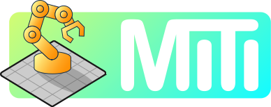

<div align="center">
  
</div>

# MITI - ROS2 Web Visualization

A modern web application for visualizing and monitoring ROS2 topics in real-time. Built with Next.js 14, React 18, and Three.js for high-performance 3D visualization.


## 🚀 Features

### Core Features
- **Real-time ROS2 Connection**: Connect to ROS2 via rosbridge_server WebSocket
- **Auto-reconnection**: Automatic reconnection on connection loss
- **Topic Management**: Browse, search, and subscribe to ROS2 topics
- **Live Data Monitoring**: View real-time topic data in JSON format

### Visualization
- **URDF 3D Viewer**: Visualize robot models from `/robot_description` topic
- **Live Robot Motion**: Robot model automatically updates with `/joint_states` topic
- **Point Cloud Viewer**: Real-time point cloud visualization from depth cameras
- **Interactive 3D Controls**: Pan, zoom, and rotate with mouse controls
- **Color Mapping**: Depth-based or RGB coloring for point clouds

### UI/UX
- **Modern Dark Theme**: Beautiful gradient-based dark interface
- **Responsive Design**: Works on desktop, tablet, and mobile
- **Real-time Updates**: Live connection status and message counts
- **Search & Filter**: Quickly find topics with instant search

## 📋 Prerequisites

Before running MITI, ensure you have the following installed:

### ROS2
- **ROS2 Distribution**: Humble Hawksbill or later
- **rosbridge_suite**: For WebSocket communication

```bash
# Install ROS2 (Ubuntu)
# Follow official ROS2 installation guide for your distribution
# https://docs.ros.org/en/humble/Installation.html

# Install rosbridge_suite
sudo apt install ros-${ROS_DISTRO}-rosbridge-suite
```

### Node.js & Bun
- **Node.js**: 20.x or later
- **Bun**: 1.0 or later (optional but recommended)

```bash
# Install Bun (optional)
curl -fsSL https://bun.sh/install | bash

# Or use npm (comes with Node.js)
```

## 🛠️ Installation

1. **Clone the repository**
```bash
git clone https://github.com/thongpanchang/miti.git
cd miti
```

2. **Install dependencies**

Using Bun (recommended):
```bash
bun install
```

Or using npm:
```bash
npm install
```

3. **Configure rosbridge connection** (optional)

You can configure the rosbridge server URL in two ways:

**Option 1: Using environment variables** (for default connection)

Copy the example environment file and edit it:
```bash
cp .env.example .env.local
```

Edit `.env.local` and set your rosbridge URL:
```env
NEXT_PUBLIC_ROSBRIDGE_URL=ws://192.168.10.27:9090
```

**Option 2: Using the UI settings** (recommended for easy switching)

Once the app is running, click the settings icon (⚙️) next to the connection status to change the rosbridge URL without editing files. The URL is saved in your browser's localStorage and persists across sessions.

Examples:
- Local development: `ws://localhost:9090`
- Remote robot: `ws://192.168.10.27:9090`
- Docker container: `ws://ros-bridge:9090`

## 🚦 Usage

### 1. Start ROS2 and rosbridge_server

First, source your ROS2 workspace and start rosbridge:

```bash
# Source ROS2
source /opt/ros/humble/setup.bash

# Start rosbridge_server
ros2 launch rosbridge_server rosbridge_websocket_launch.xml
```

The rosbridge server will start on `ws://localhost:9090` by default.

### 2. Run the MITI Dashboard

In a new terminal, start the Next.js development server:

Using Bun:
```bash
bun dev
```

Or using npm:
```bash
npm run dev
```

### 3. Open your browser

Navigate to [http://localhost:3000](http://localhost:3000)

You should see:
- ✅ Connection status showing "Connected"
- 📋 List of available ROS2 topics
- 🎨 3D visualization panels ready

## 🏗️ Architecture

### Project Structure

```
miti/
├── app/                          # Next.js App Router
│   ├── components/              # React components
│   │   ├── Dashboard.tsx        # Main dashboard layout
│   │   ├── ConnectionStatus.tsx # Connection indicator
│   │   ├── TopicViewer/        # Topic browsing components
│   │   │   ├── TopicList.tsx
│   │   │   ├── TopicCard.tsx
│   │   │   └── TopicDataDisplay.tsx
│   │   └── Visualization/       # 3D visualization components
│   │       ├── Scene3D.tsx      # Three.js scene wrapper
│   │       ├── URDFViewer.tsx   # URDF model viewer
│   │       ├── PointCloudViewer.tsx
│   │       └── ViewerControls.tsx
│   ├── hooks/                   # React hooks
│   │   ├── useRosbridge.ts     # ROS connection management
│   │   ├── useTopic.ts         # Topic subscription
│   │   └── useTopicList.ts     # Topic discovery
│   ├── globals.css             # Global styles
│   ├── layout.tsx              # Root layout
│   └── page.tsx                # Home page
├── lib/                         # Core libraries
│   ├── rosbridge/              # rosbridge client
│   │   ├── client.ts           # WebSocket client
│   │   ├── types.ts            # TypeScript types
│   │   └── messages.ts         # Message builders
│   └── utils/                  # Utility functions
│       ├── pointcloud-parser.ts
│       └── urdf-loader-helper.ts
├── types/                       # TypeScript definitions
│   └── ros-messages.d.ts       # ROS message types
└── public/                      # Static assets
```

### Technology Stack

- **Frontend Framework**: Next.js 14 (App Router)
- **Language**: TypeScript
- **Styling**: Tailwind CSS
- **3D Graphics**: Three.js, React Three Fiber, Drei
- **State Management**: Zustand (for future use)
- **Icons**: Lucide React
- **Runtime**: Bun / Node.js

## 📡 ROS2 Integration

### Supported Message Types

MITI currently supports:

- `std_msgs/String` - For URDF robot descriptions
- `sensor_msgs/JointState` - For robot joint positions (motion monitoring)
- `sensor_msgs/PointCloud2` - For point cloud data
- All standard ROS2 message types (view-only)

### URDF Loading and Motion Monitoring

MITI supports loading URDF robot models and monitoring their motion in real-time.

#### Joint States Motion Monitoring

Once a URDF model is loaded, MITI automatically subscribes to the `/joint_states` topic to animate the robot:

```bash
# The robot will automatically move as joint states are published
ros2 topic pub /joint_states sensor_msgs/msg/JointState "{name: ['joint1', 'joint2'], position: [0.5, 1.0]}"
```

**Features:**
- Real-time joint position updates
- Automatic joint name mapping
- Supports all joint types (revolute, prismatic, continuous, etc.)
- No configuration required - just publish to `/joint_states`

### URDF Loading Options

MITI supports multiple ways to load URDF robot descriptions:

#### 1. From ROS Topic (Default)

Subscribe to `/robot_description` topic or any custom topic:

```bash
# Publish URDF to ROS topic
ros2 topic pub /robot_description std_msgs/msg/String "data: '$(cat robot.urdf)'" --once
```

**In MITI:**
1. Ensure "ROS Topic" mode is selected
2. Enter your topic name (default: `/robot_description`)
3. URDF will load automatically when published

#### 2. From URL

Load URDF directly from HTTP/HTTPS URL without requiring ROS:

**Setup:**
1. Host your URDF and mesh files on a web server
2. In MITI, switch to "URL" mode
3. Enter URDF URL: `http://192.168.10.27:8000/robot.urdf`
4. Enter Mesh Base URL: `http://192.168.10.27:8000`
5. Click "Load URDF"

**Example: Using Python HTTP Server**
```bash
# In your robot description package
cd /path/to/robot_description
python3 -m http.server 8000 --bind 0.0.0.0
```

**Example: Using Python HTTP Server with CORS**
```python
# server.py
from http.server import HTTPServer, SimpleHTTPRequestHandler

class CORSRequestHandler(SimpleHTTPRequestHandler):
    def end_headers(self):
        self.send_header('Access-Control-Allow-Origin', '*')
        self.send_header('Access-Control-Allow-Methods', 'GET, OPTIONS')
        self.send_header('Access-Control-Allow-Headers', '*')
        super().end_headers()
    
    def do_OPTIONS(self):
        self.send_response(200)
        self.end_headers()

if __name__ == '__main__':
    print('Starting server on http://0.0.0.0:8000')
    HTTPServer(('0.0.0.0', 8000), CORSRequestHandler).serve_forever()
```

Run with: `python3 server.py`

#### 3. Package Path Resolution

URDF files often reference meshes using ROS package paths. MITI automatically converts these to HTTP URLs:

```
Input:  package://robot_description/meshes/base_link.stl
Base:   http://192.168.10.27:8000
Output: http://192.168.10.27:8000/meshes/base_link.stl
```

**For Complex Setups with Multiple Packages:**

You can configure package mappings for robots that use multiple packages:

```json
{
  "robot_description": "http://192.168.10.27:8000",
  "gripper_description": "http://192.168.10.27:8001",
  "sensor_description": "http://192.168.10.27:8002"
}
```

Example resolution with package mapping:
```
Input:  package://gripper_description/models/gripper.dae
Mapping: { "gripper_description": "http://192.168.10.27:8001" }
Output: http://192.168.10.27:8001/models/gripper.dae
```

#### CORS Configuration

If loading URDF from a different origin, you must configure CORS on your server. The Python example above shows how to enable CORS.

**For NGINX:**
```nginx
location / {
    add_header 'Access-Control-Allow-Origin' '*';
    add_header 'Access-Control-Allow-Methods' 'GET, OPTIONS';
    add_header 'Access-Control-Allow-Headers' '*';
}
```

**For Apache:**
```apache
Header set Access-Control-Allow-Origin "*"
Header set Access-Control-Allow-Methods "GET, OPTIONS"
Header set Access-Control-Allow-Headers "*"
```

### Adding Custom Topic Subscriptions

```typescript
import { useTopic } from '@/app/hooks/useTopic';

function MyComponent({ client }) {
  const { data, lastUpdate } = useTopic(
    client,
    '/my_topic',
    'std_msgs/String'
  );

  return <div>{data?.data}</div>;
}
```

## 🎨 Customization

### Changing the rosbridge URL

Edit `.env.local`:
```env
NEXT_PUBLIC_ROSBRIDGE_URL=ws://your-robot-ip:9090
```

### Customizing the Theme

Edit `app/globals.css` or Tailwind configuration in `tailwind.config.ts`

### Adding New Visualizations

1. Create a new component in `app/components/Visualization/`
2. Use the `useTopic` hook to subscribe to your topic
3. Add it to the Dashboard grid layout

## 🧪 Testing

### Manual Testing Checklist

- [ ] rosbridge_server connection works
- [ ] Topics list loads correctly
- [ ] Can subscribe/unsubscribe to topics
- [ ] Topic data displays in real-time
- [ ] URDF viewer loads robot models
- [ ] Robot joints move with /joint_states topic
- [ ] Point cloud renders correctly
- [ ] Reconnection works after disconnect
- [ ] Search and filter topics works
- [ ] Responsive on mobile devices
- [ ] No console errors

### Publishing Test Data

```bash
# Publish test string
ros2 topic pub /test_topic std_msgs/msg/String "data: 'Hello MITI'"

# Publish robot description (example)
ros2 topic pub /robot_description std_msgs/msg/String "data: '$(cat robot.urdf)'"

# Publish joint states for robot motion
ros2 topic pub /joint_states sensor_msgs/msg/JointState "{header: {stamp: {sec: 0, nanosec: 0}, frame_id: ''}, name: ['joint1', 'joint2'], position: [0.5, 1.0], velocity: [], effort: []}"
```

## 🐛 Troubleshooting

### Connection Issues

**Problem**: Cannot connect to rosbridge_server

**Solutions**:
- Ensure rosbridge_server is running: `ros2 node list | grep rosbridge`
- Check the WebSocket URL in `.env.local`
- Verify firewall settings allow WebSocket connections
- Check browser console for detailed error messages

### No Topics Showing

**Problem**: Topics list is empty

**Solutions**:
- Verify ROS2 nodes are running: `ros2 node list`
- Check if topics exist: `ros2 topic list`
- Try refreshing the topics list (click refresh button)
- Ensure rosbridge_server is properly connected to ROS2

### Point Cloud Not Rendering

**Problem**: Point cloud viewer shows "No data"

**Solutions**:
- Verify topic name matches your camera: `/camera/depth/points`
- Check message type is `sensor_msgs/PointCloud2`
- Ensure point cloud data is being published: `ros2 topic hz /camera/depth/points`
- Check browser console for parsing errors

### URDF Not Loading from URL

**Problem**: Cannot load URDF from URL

**Solutions**:
1. **CORS Error**: Your server needs to allow cross-origin requests
   - Use the Python CORS server example provided above
   - Configure your web server (NGINX, Apache) to send CORS headers
   - For development, you can use a CORS proxy

2. **Network Error**: 
   - Verify the URL is correct and accessible
   - Test URL in browser: `curl http://192.168.10.27:8000/robot.urdf`
   - Check if server is running and reachable
   - Verify firewall/network settings

3. **Mesh Loading Failures**:
   - Ensure Mesh Base URL is set correctly
   - Check that mesh files are accessible from the base URL
   - Verify package:// paths are being resolved correctly
   - Check browser console for specific mesh file errors

4. **URDF Parse Error**:
   - Verify URDF file is valid XML
   - Check for syntax errors in URDF file
   - Ensure file is complete (not truncated)

**Testing URDF URL Loading:**
```bash
# 1. Create test directory
mkdir -p /tmp/urdf_test/meshes
cd /tmp/urdf_test

# 2. Create simple URDF (save as robot.urdf)
cat > robot.urdf << 'EOF'
<?xml version="1.0"?>
<robot name="test_robot">
  <link name="base_link">
    <visual>
      <geometry>
        <box size="1 1 1"/>
      </geometry>
    </visual>
  </link>
</robot>
EOF

# 3. Start server with CORS
python3 -c "
from http.server import HTTPServer, SimpleHTTPRequestHandler

class CORSHandler(SimpleHTTPRequestHandler):
    def end_headers(self):
        self.send_header('Access-Control-Allow-Origin', '*')
        super().end_headers()

HTTPServer(('0.0.0.0', 8000), CORSHandler).serve_forever()
"

# 4. In MITI:
#    - Switch to URL mode
#    - URDF URL: http://localhost:8000/robot.urdf
#    - Click Load URDF
```

### Build Errors

**Problem**: Build fails with dependency errors

**Solutions**:
```bash
# Clear cache and reinstall
rm -rf node_modules .next
bun install
# or
npm install

# If using Bun and it crashes, use npm instead
npm run dev
```

## 🚀 Production Build

```bash
# Build for production
bun run build
# or
npm run build

# Start production server
bun start
# or
npm start
```

## 📚 Additional Resources

- [ROS2 Documentation](https://docs.ros.org/en/humble/)
- [rosbridge_suite](https://github.com/RobotWebTools/rosbridge_suite)
- [Next.js Documentation](https://nextjs.org/docs)
- [React Three Fiber](https://docs.pmnd.rs/react-three-fiber/)
- [Three.js](https://threejs.org/docs/)

## 🤝 Contributing

Contributions are welcome! Please feel free to submit a Pull Request.

1. Fork the repository
2. Create your feature branch (`git checkout -b feature/AmazingFeature`)
3. Commit your changes (`git commit -m 'Add some AmazingFeature'`)
4. Push to the branch (`git push origin feature/AmazingFeature`)
5. Open a Pull Request

## 📝 License

This project is licensed under the MIT License - see the LICENSE file for details.

## 🙏 Acknowledgments

- ROS2 and the Robot Operating System community
- rosbridge_suite developers
- Three.js and React Three Fiber teams
- Next.js and Vercel teams

## 📧 Contact

For questions or support, please open an issue on GitHub.

---

**Made with ❤️ for the ROS2 community**
