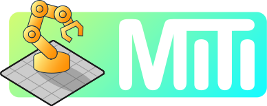

<div align="center">
  

# MITI - ROS2 Web Visualization

**A modern, real-time web dashboard for visualizing ROS2 robots and sensor data.**

Built with Next.js 14, React 18, Three.js, and Electron.

[](https://docs.ros.org/)
[](https://nextjs.org/)
[](https://www.typescriptlang.org/)
[](LICENSE)

</div>

---

## Table of Contents

- [Features](#features)
- [Prerequisites](#prerequisites)
- [Installation](#installation)
- [Usage](#usage)
- [Desktop App (Electron)](#desktop-app-electron)
- [Project Structure](#project-structure)
- [ROS2 Integration](#ros2-integration)
- [Customization](#customization)
- [Testing](#testing)
- [Troubleshooting](#troubleshooting)
- [Uninstalling](#uninstalling)
- [Contributing](#contributing)
- [License](#license)
- [Acknowledgments](#acknowledgments)

---

## Features

**Visualization**

- URDF 3D robot model viewer with live joint state animation
- Point cloud rendering from depth cameras
- Camera feed viewer (color, depth, IR, detection)
- TF frame visualization
- State machine monitor (SMACC2 and BehaviorTree)

**Dashboard**

- Draggable, resizable widget grid layout
- Persistent configuration saved in localStorage
- Add/remove widgets on the fly
- Configurable ROS topics per widget

**Connectivity**

- Real-time ROS2 connection via rosbridge WebSocket
- Auto-reconnection on connection loss
- Topic discovery, search, and live data monitoring

---

## Prerequisites

- **Node.js** 20+ and **npm** (or [Bun](https://bun.sh/))
- **ROS2** Humble Hawksbill or later
- **rosbridge_suite** for WebSocket communication

Install rosbridge on Ubuntu:

```bash
sudo apt install ros-humble-rosbridge-suite
```

---

## Installation

```bash
git clone https://github.com/hiran-t/miti.git
cd miti
npm install
```

### Configure Connection (optional)

**Option A** - Environment variable:

```bash
cp .env.example .env.local
```

Edit `.env.local`:

```env
NEXT_PUBLIC_ROSBRIDGE_URL=ws://192.168.10.27:9090
```

**Option B** - UI settings (recommended):

Click the settings icon next to the connection status in the app to change the URL at runtime. The setting persists in localStorage.

---

## Usage

### 1. Start rosbridge

```bash
source /opt/ros/humble/setup.bash
ros2 launch rosbridge_server rosbridge_websocket_launch.xml
```

### 2. Start MITI

```bash
npm run dev
```

Open [http://localhost:3000](http://localhost:3000).

### 3. Production build (web)

```bash
npm run build
npm start
```

---

## Desktop App (Electron)

MITI can be packaged as a standalone desktop app. End users do not need Node.js.

### Build commands

| Platform | Command                        | Output                                   |
| -------- | ------------------------------ | ---------------------------------------- |
| macOS    | `npm run electron:build:mac`   | `dist-electron/MITI-*.dmg`               |
| Windows  | `npm run electron:build:win`   | `dist-electron/MITI-*-Setup.exe`         |
| Linux    | `npm run electron:build:linux` | `dist-electron/MITI-*.deb`, `*.AppImage` |

Each command runs: `next build` (static export) -> `electron-prepare.js` -> `electron-builder`.

### Development mode

```bash
npm run electron:dev
```

### Cross-compilation

Build each platform on its native OS, or use CI/CD (e.g., GitHub Actions).

| Host    | macOS | Windows | Linux |
| ------- | ----- | ------- | ----- |
| macOS   | Yes   | Wine    | No    |
| Windows | No    | Yes     | No    |
| Linux   | No    | No      | Yes   |

### Install on Linux

```bash
# .deb (system-wide)
sudo dpkg -i dist-electron/MITI-*.deb

# AppImage (portable, no install)
chmod +x dist-electron/MITI-*.AppImage
./dist-electron/MITI-*.AppImage
```

---

## Project Structure

```
miti/
├── src/
│   ├── app/                     # Next.js App Router (layout, page, globals.css)
│   ├── components/features/     # Feature-based components
│   │   ├── connection/          #   Connection status & settings
│   │   ├── controls/            #   Button/switch widgets
│   │   ├── dashboard/           #   Main dashboard
│   │   ├── layout/              #   Grid layout, widget container
│   │   ├── topic-viewer/        #   Topic list, cards, data display
│   │   └── visualization/       #   Camera, point cloud, URDF, TF, state machine
│   ├── hooks/                   # React hooks (useRosbridge, useTopic, useTF, etc.)
│   ├── lib/                     # Core libraries (rosbridge client, parsers)
│   ├── styles/                  # Centralized Tailwind style modules
│   ├── types/                   # TypeScript definitions
│   └── constants/               # ROS topic constants
├── electron/                    # Electron main process & preload
├── build/                       # NSIS installer hooks, uninstall scripts
├── public/                      # Static assets (logos, icons)
├── package.json
├── tsconfig.json
├── tailwind.config.ts
└── next.config.js
```

---

## ROS2 Integration

### Supported message types

| Type                      | Used for                    |
| ------------------------- | --------------------------- |
| `std_msgs/String`         | URDF robot description      |
| `sensor_msgs/JointState`  | Joint positions (animation) |
| `sensor_msgs/PointCloud2` | Point cloud data            |
| `sensor_msgs/Image`       | Camera feeds                |
| `tf2_msgs/TFMessage`      | TF frame transforms         |

All standard ROS2 message types can be viewed in the topic browser.

### URDF loading

**From ROS topic** (default):

```bash
ros2 topic pub /robot_description std_msgs/msg/String \
  "data: '$(cat robot.urdf)'" --once
```

**From URL**:

1. Serve URDF files with a CORS-enabled HTTP server:

```bash
cd /path/to/robot_description
python3 -m http.server 8000
```

2. In MITI, switch to URL mode and enter:
   - URDF URL: `http://<host>:8000/robot.urdf`
   - Mesh Base URL: `http://<host>:8000`

Package paths like `package://robot_description/meshes/base.stl` are resolved against the mesh base URL automatically.

### Publishing test data

```bash
# String topic
ros2 topic pub /test std_msgs/msg/String "data: 'Hello MITI'"

# Joint states
ros2 topic pub /joint_states sensor_msgs/msg/JointState \
  "{name: ['joint1', 'joint2'], position: [0.5, 1.0], velocity: [], effort: []}"
```

---

## Customization

### Subscribing to a custom topic

```typescript
import { useTopic } from '@/hooks/useTopic';

function MyWidget({ client }) {
  const { data, lastUpdate } = useTopic(client, '/my_topic', 'std_msgs/String');
  return <div>{data?.data}</div>;
}
```

### Adding a new widget

1. Define props in `src/types/widget.ts`
2. Create component in `src/components/features/visualization/<name>/`
3. Register in `src/components/features/layout/WidgetContainer.tsx`
4. Add widget metadata to `WIDGET_TYPES` in `src/types/widget.ts`

### Modifying styles

All styles are centralized in `src/styles/`. Edit the relevant module:

- `common.styles.ts` - Buttons, inputs, cards, modals
- `visualization.styles.ts` - Camera, URDF, point cloud viewers
- `widget.styles.ts` - Widget containers
- `dashboard.styles.ts` - Dashboard layout

### Connection settings

| Method       | File / Location                 | Persists       |
| ------------ | ------------------------------- | -------------- |
| `.env.local` | `NEXT_PUBLIC_ROSBRIDGE_URL`     | Per deployment |
| UI settings  | Settings icon in the header bar | localStorage   |

---

## Testing

```bash
# Unit tests
npm test

# Watch mode
npm run test:watch

# Coverage
npm run test:coverage

# Type checking
npm run type-check

# Lint
npm run lint
npm run lint:fix

# Format
npm run format
npm run format:check
```

---

## Troubleshooting

### Cannot connect to rosbridge

- Verify rosbridge is running: `ros2 node list | grep rosbridge`
- Check the WebSocket URL (default: `ws://localhost:9090`)
- Check firewall settings for port 9090

### Topics list is empty

- Verify ROS2 nodes are running: `ros2 topic list`
- Click the refresh button in the topic browser
- Check rosbridge logs for errors

### URDF not loading from URL

- Ensure the HTTP server sends CORS headers (`Access-Control-Allow-Origin: *`)
- Test the URL directly: `curl http://<host>:8000/robot.urdf`
- Check browser console for specific errors

### Point cloud not rendering

- Verify topic publishes `sensor_msgs/PointCloud2`
- Check data rate: `ros2 topic hz /camera/depth/points`

### Build errors

```bash
rm -rf node_modules .next
npm install
```

---

## Uninstalling

### Windows

- Open **Settings > Apps & Features**, find "MITI", click Uninstall
- Or use the "Uninstall MITI" shortcut in the Start Menu

### macOS

- Drag **MITI.app** from Applications to Trash

### Linux

```bash
# If installed via .deb
sudo apt remove miti
# or
sudo dpkg -r miti

# If using AppImage, just delete the file
```

An `uninstall.sh` helper script is also included in the Linux build.

---

## Contributing

1. Fork the repository
2. Create a feature branch: `git checkout -b feature/my-feature`
3. Commit your changes: `git commit -m 'Add my feature'`
4. Push: `git push origin feature/my-feature`
5. Open a Pull Request

---

## License

MIT License - see [LICENSE](LICENSE) for details.

---

## Acknowledgments

- [ROS2](https://docs.ros.org/) and the robotics community
- [rosbridge_suite](https://github.com/RobotWebTools/rosbridge_suite)
- [Three.js](https://threejs.org/) and [React Three Fiber](https://docs.pmnd.rs/react-three-fiber/)
- [Next.js](https://nextjs.org/)
- [Tailwind CSS](https://tailwindcss.com/)
- [Electron](https://www.electronjs.org/)
- [urdf-loader](https://github.com/gkjohnson/urdf-loaders)
