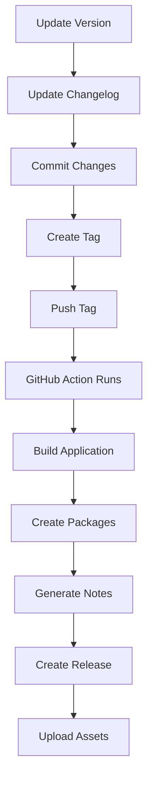

# 📦 How to Create a Release

This guide explains how to create a new release of MITI with downloadable packages.

## 🚀 Quick Release

```bash
# 1. Update version in package.json
# 2. Update CHANGELOG.md
# 3. Commit changes
git add package.json CHANGELOG.md
git commit -m "chore: bump version to 1.0.0"

# 4. Create and push tag
git tag -a v1.0.0 -m "Release v1.0.0"
git push origin main
git push origin v1.0.0
```

The GitHub Action will automatically:

1. ✅ Build the application
2. ✅ Create standalone package (~100 MB)
3. ✅ Build Docker image (~500 MB)
4. ✅ Generate release notes
5. ✅ Create GitHub Release with downloadable files

## 📋 Release Checklist

Before creating a release:

- [ ] All tests pass (`bun test`)
- [ ] No linting errors (`bun run lint`)
- [ ] Build successful (`bun run build`)
- [ ] Version updated in `package.json`
- [ ] `CHANGELOG.md` updated with changes
- [ ] Documentation updated if needed
- [ ] Breaking changes documented

## 📦 What Gets Released

Each release includes 2 downloadable packages:

### 1. Docker Image

- **Filename**: `miti-docker-v1.0.0.tar.gz`
- **Size**: ~500 MB
- **Contains**: Complete Docker image
- **Usage**:
  ```bash
  docker load < miti-docker-v1.0.0.tar.gz
  docker run -d -p 3000:3000 --name miti miti:v1.0.0
  ```

### 2. Standalone Build

- **Filename**: `miti-standalone-v1.0.0.tar.gz`
- **Size**: ~100 MB
- **Contains**: Built application + setup scripts
- **Usage**:
  ```bash
  tar -xzf miti-standalone-v1.0.0.tar.gz
  ./ubuntu-setup.sh
  ```

## 🔢 Version Numbering

Follow [Semantic Versioning](https://semver.org/):

- **MAJOR** (1.0.0): Breaking changes
- **MINOR** (0.1.0): New features, backwards compatible
- **PATCH** (0.0.1): Bug fixes

Examples:

- `v1.0.0` - First stable release
- `v1.1.0` - Added new widget type
- `v1.1.1` - Fixed connection bug
- `v2.0.0` - Changed API (breaking)

## 📝 Release Notes Format

The workflow automatically generates release notes from git commits.

Use [Conventional Commits](https://www.conventionalcommits.org/):

```bash
feat: add new point cloud coloring option
fix: resolve WebSocket reconnection issue
docs: update API documentation
chore: update dependencies
```

## 🧪 Test Release Locally

Before creating an official release:

```bash
# Test standalone build
./deploy.sh
# Select option 2

# Test Docker build
./deploy.sh
# Select option 1

# Verify packages work
tar -xzf miti-standalone-*.tar.gz
# Test extracted files

docker load < miti-docker-*.tar
docker run -p 3000:3000 miti:latest
```

## 🔄 Release Workflow



## 🎯 Manual Release (if needed)

If you need to create a release manually:

```bash
# 1. Build standalone
bun run build
mkdir -p deploy/miti
cp -r .next/standalone/* deploy/miti/
cp -r .next/static deploy/miti/.next/static/
cp -r public deploy/miti/public/
cp ubuntu-setup.sh deploy/
tar -czf miti-standalone-v1.0.0.tar.gz deploy/

# 2. Build Docker
docker build -t miti:v1.0.0 .
docker save miti:v1.0.0 | gzip > miti-docker-v1.0.0.tar.gz

# 3. Create release on GitHub
# - Go to Releases
# - Click "Draft a new release"
# - Create tag: v1.0.0
# - Upload both tar.gz files
# - Publish release
```

## 🐛 Troubleshooting

### Build fails

```bash
# Clear cache and retry
rm -rf .next node_modules
bun install
bun run build
```

### Tag already exists

```bash
# Delete local and remote tag
git tag -d v1.0.0
git push --delete origin v1.0.0

# Create new tag
git tag -a v1.0.0 -m "Release v1.0.0"
git push origin v1.0.0
```

### Release workflow doesn't trigger

- Check that tag format is correct: `v*.*.*`
- Check GitHub Actions are enabled
- Check workflow file syntax

## 📊 After Release

1. Announce on social media
2. Update documentation links
3. Close related issues
4. Update project board
5. Plan next release

## 🔗 Resources

- [GitHub Releases Documentation](https://docs.github.com/en/repositories/releasing-projects-on-github)
- [Semantic Versioning](https://semver.org/)
- [Conventional Commits](https://www.conventionalcommits.org/)
- [Keep a Changelog](https://keepachangelog.com/)
